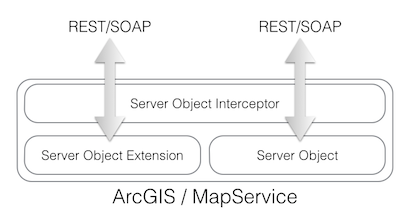
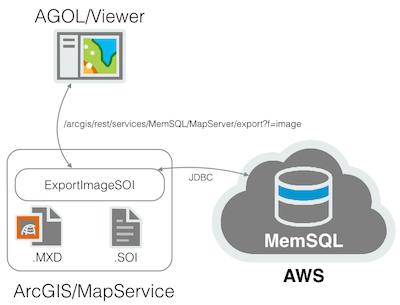
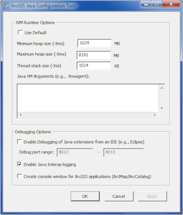
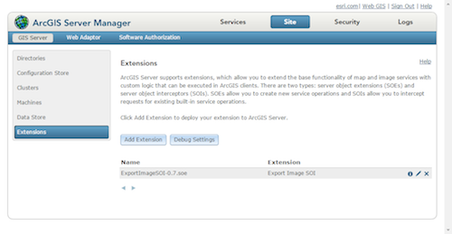
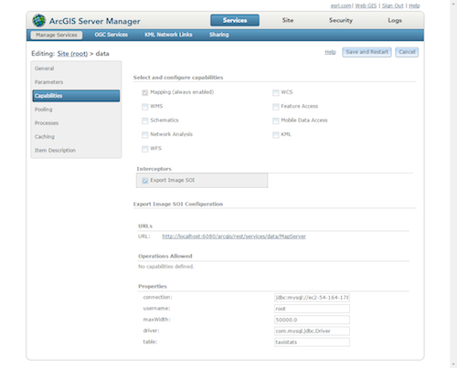
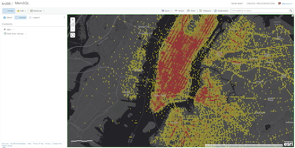

# ArcGIS Server Object Interceptor and MemSQL

Server Object Interceptors (SOI) have the same API as [Server Object Extensions](http://resources.arcgis.com/en/help/main/10.1/index.html#//0154000004s5000000) (SOE), and
are intended to extend an ArcGIS Server with custom capabilities.
An SOI intercepts REST and/or SOAP calls on a Map Service before and/or after it executes an operation on an SOE or Server Object (SO).
Think [servlet filters](http://www.oracle.com/technetwork/java/filters-137243.html).



A use case of an interceptor is to manipulate the visibility of layers or data fields based on the user credentials in single-sign-on based request.

Another use case of an SOI associated with a published MXD is to intercept an export image operation and digitally watermark the original resulting image for copyright purposes.

Whenever a pan or a zoom occurs in WebMap with a layer referencing a Dynamic MapService, it is internally invoking an export image operation with an optional set of parameters:

* An output image size in pixels
* A current map extent in typically geographic degrees or web mercator meters values
* A "where" clause with constraining feature attribute values

The default implementation performs a spatial query on the registered data source constraining the output features by the
supplied map extent and the "where" clause. It draws the resulting set of features on an off-screen image and returns that image to the caller.

In this project, the SOI implementation intercepts the export image operation, draws the features on an off-screen image. However the query of the features is performed on an "external" data source.

That external data source is [MemSQL](http://www.memsql.com/) with its newly enhanced [geospatial capabilities](http://blog.memsql.com/geospatial-intelligence/).
A client that implements the [MySQL wire protocol](http://dev.mysql.com/doc/internals/en/client-server-protocol.html) can interact with a MemSQL server and execute spatial SQL.
Mind you that this is not an implementation of the [OpenGIS Simple Features Specification](http://en.wikipedia.org/wiki/Simple_Features), but has enough spatial functions for this SOI.



## Building The Project

An SOI can be implemented in .NET or Java. This implementation is based on [Scala](http://www.scala-lang.org/) (because I can :-)

Before proceeding, make sure that the ArcGIS JVM is configured with adequate heap space using the ArcGIS Java Configuration Tool:



An SOI is packaged inside an soe file. An soe file is a [zipped](http://en.wikipedia.org/wiki/Zip_%28file_format%29) folder
that contains a `Config.xml` file and an `Install` folder containing all the runtime jar dependencies.
The `Config.xml` enumerates the SOE/I and is the place holder for the SOE/I display name, description, entry point class name and custom properties.
The automation of the soe file generation is done using [Maven](http://maven.apache.org/) in this project.
I would like to thank my coworker Carsten P. for the boost into the realm of SOIs and for graciously sharing the initial [pom.xml](http://maven.apache.org/pom.html).

**Note**: Before the initial build, Locate the `arcobjects.jar` file in your ArcGIS installation (on my machine, It was in `C:\Program Files\ArcGIS\Server\framework\lib`) and add it to your local maven repository using:

```
mvn install:install-file\
 -Dfile="arcobjects.jar"\
 -DgroupId=com.esri\
 -DartifactId=arcobjects\
 -Dversion=10.3.1\
 -Dpackaging=jar\
 -DgeneratePom=true
```

Build the project using:

```
mvn clean package
```

This will create a file named `ExportImageSOI-0.7.soe` in the `target` folder.

## Adding The Extension

Add the extension to the site using the ArcGIS Server Manager:



## Adding Capabilities

An SOI is associated with a publish MapService. Since we are intercepting the export image request, we just need a "stand-in" MapService.
In my case, I created a simple feature class with one feature at (0,0) and published it as the stand-in MapService onto which I enabled the SOI capabilities.



Note that when you select the SOI, you have the option to configure its runtime properties.
These are configured with default values in the `Config.xml` file.  The latter is generated by `Maven` during packaging using the `src/assembly/soe-config.xml` file as a template.

## Troubleshooting

Sometime during rapid development and deployment, the underlying COM caching in ArcGIS gets....not sure exactly what word to use, so I'm going to say...confused !
And that results in the famous-but-useless error code "0x99999 - Unspecified Error" message. God bless the heart of the COM core developers.

The best way I found out to [keep calm and carry on](http://en.wikipedia.org/wiki/Keep_Calm_and_Carry_On) is to do the following:

* Stop the ArcGIS Server using the `Services` application.
* Navigate to the hidden `C:\Users\arcgis\AppData\Local\ESRI\Server10.3\AssemblyCache` folder
* Delete all the folders with GUID as names
* Start the ArcGIS Server

## Implementation Details

The `ExportImageSOI.scala` extends the `AbstractSOI.java` class that contains the boilerplate code to becoming an interceptor instance.
That means implementing the `IServerObjectExtension`, `IRESTRequestHandler`, `IWebRequestHandler`, `IRequestHandler2` interfaces as default handlers.
`ExportImageSOI` implements the `IObjectConstruct` interface which enables us to access the runtime properties whose default values are in the `Config.xml`.
In this SOI implementation, a reference to the [JDBC MySQL driver](http://dev.mysql.com/downloads/connector/j/) is invoked forcing it to load to enable the connection to a MemSQL AWS based instance.
In addition, a linear [color gradient](http://en.wikipedia.org/wiki/Color_gradient) is constructed to be used later by the heatmap image generator.
The `handleRESTRequest` method is implemented to intercept any REST service invocations. If the argument `operationName` has a value of `export` and the argument `outputFormat` has a value of `image`, then
the call is intercepted by the `doExportImage` method otherwise the default handler is invoked.
The `doExportImage` extracts from the `operationInputs` the image `size` and the current map extent `bbox` (bounding box).
The latter is used to compose a MemSQL spatial query that groups and counts all taxis pickups in a "coinciding" location using the following SQL:

```sql
select count(1),round(geography_latitude(pickup),3),round(geography_longitude(pickup),3)
from taxistats where geography_intersects(pickup, 'POLYGON((-74.96857503 40.79939298,...))')
group by 2,3 order by 1
```

Note that `pickup` is a `Point` type in the `taxistats` table onto which we can apply the `geography_latitude` and `geography_longitude`
functions to extract the latitude and longitude values. To perform the spatial cookie cutting, the `geography_intersects` function is applied in the
where clause with a POLYGON in [WKT](http://en.wikipedia.org/wiki/Well-known_text) format.

An in memory image is created using [BufferedImage](http://docs.oracle.com/javase/7/docs/api/java/awt/image/BufferedImage.html), onto which
we can draw the returned rows as colored filled rectangles.  The fill color is proportionally mapped by the count value to the linear gradient
color ramp, and the rectangle pixel dimensions are proportional to the map extent and image size.

The buffered image is converted to a byte array in PNG format using [ImageIO](http://docs.oracle.com/javase/7/docs/api/javax/imageio/ImageIO.html), and the byte array is returned back to caller to be displayed as a layer in a web map.



## A Bit of History

See the above off-screen image generation using AWT? That is **exactly** the same code that I used almost 20 years ago when I implemented
the first prototype of [ArcIMS](http://en.wikipedia.org/wiki/ArcIMS) using Java over a couple of [Fat Tire](http://www.newbelgium.com/beer/detail.aspx?id=7c5b394b-d7b7-486a-ac9a-316256a7b0ee) in Denver, CO.
At the time, there was no [JIT](http://en.wikipedia.org/wiki/Just-in-time_compilation) in the JVM and the drawing was painfully slow.
We ended up implementing the drawing and the container in C++ using an in memory graphics library that we purchased.
What is old is new again! And when you get to my age, you get to see history amazingly repeat itself - hopefully for the better.
